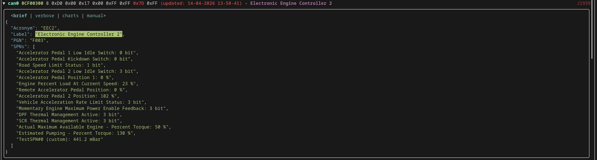
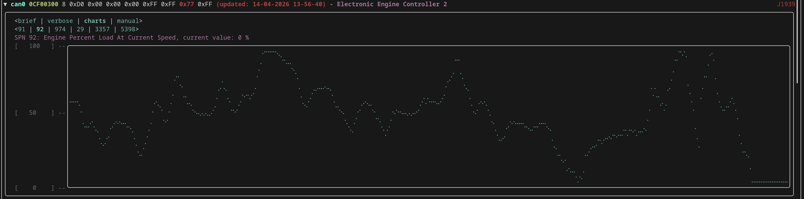
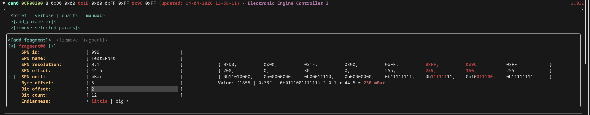
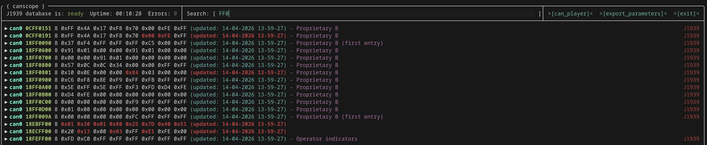
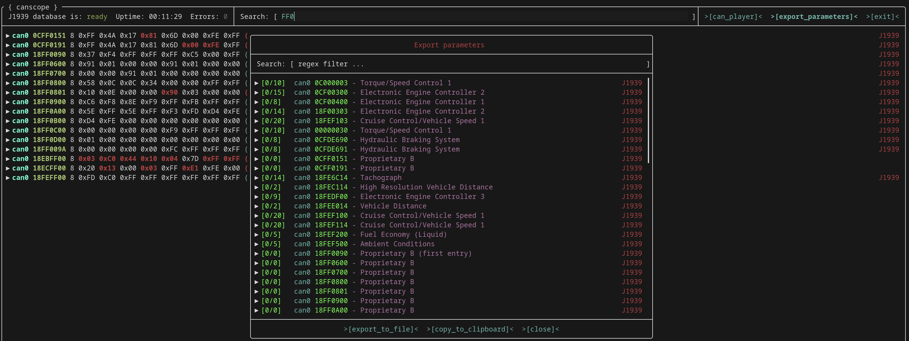
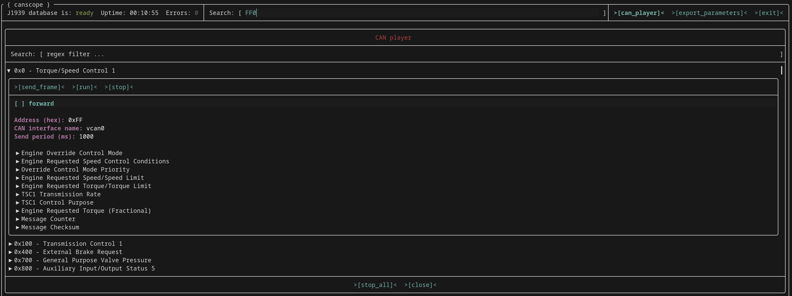

# {canscope}

CAN bus sniffer and SAE J1939 protocol analyzer. Reads CAN frames in `candump` format, decodes them using a J1939 Digital Annex (xlsx or csv), and presents results in an interactive terminal UI or as JSON output.


## Features

- **TUI mode** - full-screen interactive terminal interface (FTXUI). Four display modes per CAN ID: `brief`, `verbose`, `charts`, `manual`
- **Per-SPN live charts** - scatter plot (braille canvas) per numeric SPN with auto-scaled Y axis, switchable between all SPNs of the PGN
- **Regex search/filter** - filter the CAN ID list by regex over identifier and PGN label
- **Headless mode** - NDJSON output to stdout, for scripting and automation
- **Recording** - decoded J1939 SPN values saved to SQLite database with gzip compression and batch flushing
- **CAN playback** - replay recorded CAN frames
- **Custom SPN configuration** - per-parameter settings (up to 5 fragments), user-defined id/name/unit/resolution/offset/endianness. Custom SPNs also appear in the charts tab
- **Candump parser hardening** - strict per-frame validation (CAN ID length & hex, DLC format, payload byte count, 64-byte upper bound, DLC vs actual byte count). Error frames counted in the status bar, RTR frames silently dropped
- **Real-time** - 30 fps UI refresh

### Screenshots

**SPN viewer** - `verbose` tab, full PGN/SPN breakdown with live values

**Live charts** - per-SPN scatter plot with auto-scaled Y axis

**Reverse engineering** - `manual` tab, build custom SPN from raw bits with live payload highlighting

**Regex search** - filter by CAN ID / PGN label

**Parameter export** - select SPNs across CAN IDs for JSON export

**Playback** - replay recorded SQLite sessions


## Build

**Requirements:**
- clang++ with C++20 support
- CMake >= 3.13
- Ninja
- System libraries: boost (signals2, spirit, phoenix, regex), sqlite3, zlib, icu

Dependencies fetched automatically via CMake FetchContent:

- [FTXUI](https://github.com/ArthurSonzogni/FTXUI) - terminal UI framework
- [tiny-process-library](https://gitlab.com/eidheim/tiny-process-library) - subprocess management
- [sqlite_modern_cpp](https://github.com/SqliteModernCpp/sqlite_modern_cpp) - modern C++ SQLite wrapper
- [xlnt](https://github.com/xlnt-community/xlnt) - xlsx reading
- [lely-core](https://gitlab.com/lely_industries/lely-core) - CANopen protocol stack
- [fmt](https://github.com/fmtlib/fmt) - text formatting
- [nlohmann/json](https://github.com/nlohmann/json) - JSON library
- [clipp](https://github.com/muellan/clipp) - CLI argument parsing

### Available targets

```bash
make list              # Show all targets

make build             # Native build (dynamic linking)
make build_static      # Native build (static linking)
make install           # Install to PREFIX (default /usr/local), requires patchelf
make install_static    # Install static binary to PREFIX

make docker-run ARGS='...'       # Build and run in Docker (cross-platform)
make build_arm64                 # Cross-compile for arm64 (dynamic)
make build_arm64_static          # Cross-compile for arm64 (static)

make clean             # Remove all build artifacts
```

### Native build

```bash
make build
./build/native/canscope -e "candump can0" -j1939-xlsx thirdparty/j1939da_2018.xlsx
# or with CSV (faster parsing)
./build/native/canscope -e "candump can0" -j1939-csv thirdparty/j1939da_2018.csv
```

### Docker (cross-platform)

Works on Linux, macOS (?), and Windows (?). Requires only Docker and Make.

```bash
# TUI mode - local CAN interface
make docker-run ARGS='-e "candump can0" -j1939-xlsx thirdparty/j1939da_2018.xlsx'

# TUI mode - remote CAN interface via SSH (no data if will ask password - use public key access or sshpass utility)
make docker-run ARGS='-e "ssh user@remote candump can0" -j1939-xlsx thirdparty/j1939da_2018.xlsx'

# Discover mode - find out what PGNs/SPNs are on the bus
make docker-run ARGS='-discover -e "candump can0" -j1939-xlsx thirdparty/j1939da_2018.xlsx'

# Headless mode - stream decoded values
make docker-run ARGS='-hl -e "candump can0" -j1939-xlsx thirdparty/j1939da_2018.xlsx'
```

### Cross-compile for arm64

```bash
make build_arm64           # dynamic linking
make build_arm64_static    # static linking
```

Requires Docker. SSH keys from `~/.ssh` and `/etc/hosts` are forwarded into the build container for fetching private git dependencies.

## Usage

All operating modes are mutually exclusive. If none is specified, TUI mode is used.

```bash
# TUI mode (default) - interactive terminal interface
canscope -e "candump can0" -j1939-xlsx thirdparty/j1939da_2018.xlsx

# Discover mode - output PGN/SPN structure (no values) to stdout or file
canscope -discover -e "candump can0" -j1939-xlsx thirdparty/j1939da_2018.xlsx
canscope -discover -of discovered.json -e "candump can0" -j1939-csv thirdparty/j1939da_2018.csv

# Headless mode - stream all decoded values (NDJSON) to stdout
canscope -hl -e "candump can0" -j1939-xlsx thirdparty/j1939da_2018.xlsx

# Record mode - write all decoded values + timestamps to SQLite
canscope -rec -db recording.db -e "candump can0" -j1939-xlsx thirdparty/j1939da_2018.xlsx

# Read from stdin (pipe)
candump can0 | canscope -j1939-csv thirdparty/j1939da_2018.csv
```

> **Note:** J1939 decoding has only been tested with the Digital Annex 2018 edition. Other editions may work but are not guaranteed.

### Modes

| Mode | Flag | Description |
|------|------|-------------|
| TUI | *(default)* | Interactive full-screen terminal UI |
| Discover | `-discover` | Output PGN/SPN structure (no values) to stdout or file (`-of`) |
| Headless | `-hl` | Stream all decoded PGN/SPN values as NDJSON to stdout |
| Record | `-rec` | Write all decoded PGN/SPN values + timestamps to SQLite (`-db`) |

### CLI flags

| Flag | Long form | Description |
|------|-----------|-------------|
| `-j1939-xlsx` | | J1939 Digital Annex xlsx file |
| `-j1939-csv` | | J1939 Digital Annex csv file (faster parsing) |
| `-e` | `--execute-command` | Command to read CAN frames from (e.g. `"candump can0"`) |
| `-discover` | | Discover mode |
| `-hl` | `--headless` | Headless mode |
| `-rec` | `--record` | Record mode |
| `-of` | `--output-file` | Output file path (used with `-discover`) |
| `-db` | `--database` | SQLite database path (required with `-rec`) |
| `-h` | `--help` | Show help |

## Roadmap

- **NMEA 2000 protocol support** - NMEA 2000 decoding using [canboat](https://github.com/canboat/canboat) PGN database (JSON). Same 29-bit CAN ID as J1939, requires Fast Packet protocol implementation
- **CANopen protocol support** - CANopen decoding alongside J1939 (11-bit CAN ID, SDO/PDO/NMT)
- **Other small features and enhancements** - UI improvements, performance optimizations, additional export formats
